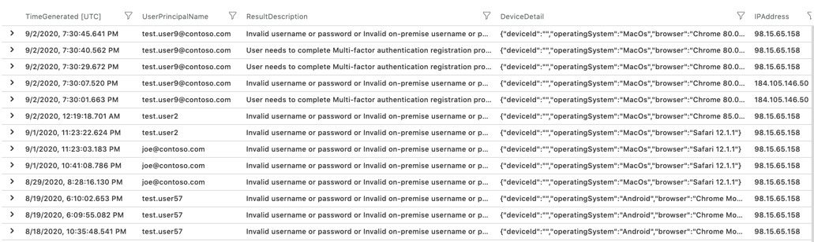
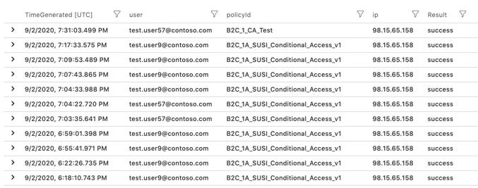
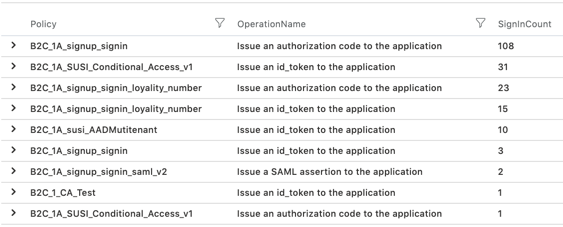
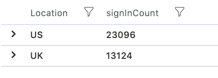
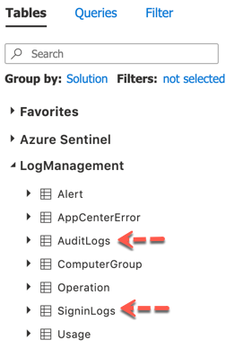

# Reports | Alerts | Dashboards

In this repo, you will find samples for reporting, alerts and dashboards using Azure AD B2C logs. 

## Getting Started

- Read about [Audit Logs](https://docs.microsoft.com/en-us/azure/active-directory-b2c/view-audit-logs) and [SignIn Logs](https://docs.microsoft.com/en-us/azure/active-directory/reports-monitoring/reference-azure-monitor-sign-ins-log-schema) to gain better understanding about their usage and schema.

- Read about [Azure Monitoring](https://docs.microsoft.com/en-us/azure/azure-monitor/overview) to understand its key features.

- Read about [Log Analytics Queries](https://docs.microsoft.com/en-us/azure/azure-monitor/log-query/get-started-portal) to understand how to create and run reports using [Kusto](https://docs.microsoft.com/en-us/azure/data-explorer/kusto/concepts/) lanaguage.

- Read about [Azure Alerts](https://docs.microsoft.com/en-us/azure/azure-monitor/platform/alerts-overview) their benefits and usage patterns.

- Read about [Azure Dashboards](https://docs.microsoft.com/en-us/azure/azure-portal/azure-portal-dashboards) to understand how to create, customzie, publish and share dashboards.

## Prerequisites

- You will require to create an Azure AD B2C directory, see the guidance [here](https://docs.microsoft.com/en-us/azure/active-directory-b2c/tutorial-create-tenant).

- To use the sample artificats in this repo, follow the instructions described by the article [Monitor Azure AD B2C with Azure Monitor
](https://docs.microsoft.com/en-us/azure/active-directory-b2c/azure-monitor
) to setup Azure Monitor to route sign-in and auditing logs to Log Analytics workspace. After the setup is complete, it may take upto 45 minutes or so for logs to show up in Log Analytics workspace. Subsequently, Azure monitor sync the logs within few minutes as they get generated by Azure AD B2C.

## Reports

### Failed Sign-Ins

This report shows failed sign-ins by the users over the past x days. The default duration is set to 90 days i-e ```90d```.

```
SigninLogs
| where TimeGenerated >= ago(90d)
| where ResultType !~ "0" 
| summarize  by TimeGenerated, UserPrincipalName, ResultDescription, tostring( DeviceDetail), IPAddress
| sort by TimeGenerated desc   
```
 


### Last Sign-In 

This report shows last sucessful sign-in by the users over the past x days. The default duration is set to 90 days i-e ```90d```.

```
AuditLogs 
| where TimeGenerated >= ago(90d)
| where OperationName == "Validate local account credentials" 
| where Result == "success" 
| extend details=parse_json(AdditionalDetails)  
| extend user = tostring(details[4].value)  
| extend policyId = tostring(details[1].value)  
| extend appId = tostring(details[2].value)  
| extend ip = tostring(details[5].value)  
| project TimeGenerated, Result, user, policyId, ip 
|sort by TimeGenerated desc
```


### Policy Usage By Operation

This report shows policy usage by operation over the past x days. The default duration is set to 90 days i-e ```90d```. Notice that the query is focused only on the operation where some token/code is issued by policy.

```
AuditLogs 
| where TimeGenerated  > ago(90d)
| where OperationName contains "issue"
| extend  UserId=extractjson("$.[0].id",tostring(TargetResources))
| extend Policy=extractjson("$.[1].value",tostring(AdditionalDetails))
| summarize SignInCount = count() by Policy, OperationName
| order by SignInCount desc  nulls last   
```



### Total Sign-Ins by Region

This reports shows all total number of sign-ins for the past x days. This include sign-ins for Azure Portal and Azure AD B2C Policy.

```
SigninLogs
| where TimeGenerated  > ago(90d)
| where AppDisplayName != ""
|summarize signInCount = count() by Location
```



If you like to limit the report to only include sign-ins that are occured through the Azure AD B2C policies, update the query as follows:

```
SigninLogs
| where TimeGenerated  > ago(90d)
| where AppDisplayName  == "ProxyIdentityExperienceFramework"
| project OperationName, Location, UserPrincipalName, AppDisplayName
|summarize signInCount = count() by Location
```

### Total Sign-Ins Per Browser

This reports shows all total number of sign-ins for the past x days. This include sign-ins for Azure Portal and Azure AD B2C Policy.

```
SigninLogs
|where TimeGenerated >= ago(90d)
|extend OS= DeviceDetail.operatingSystem
|extend Browser =extract("([a-zA-Z]+)",1,tostring(DeviceDetail.browser))
|where OS!=""
|where Browser !=""
|where AppDisplayName  == "ProxyIdentityExperienceFramework"
|summarize Total = count() by Browser
```


## Dasbhoard

## Alerts


## FAQ

- How do I know Azure AD B2C logs are available in Logs Analytics workspace?

  Azure AD B2C AuditLogs and SigninLogs shows up in the LogManagement console as shown below.
  
  

- Why my reports are not able to showing data beyond past 30 days?

  By default Logs Analytics workspace only retain data for 30 days. You can change the retention period by using the instructions provided [here](https://docs.microsoft.com/en-us/azure/azure-monitor/platform/manage-cost-storage#change-the-data-retention-period)
  


